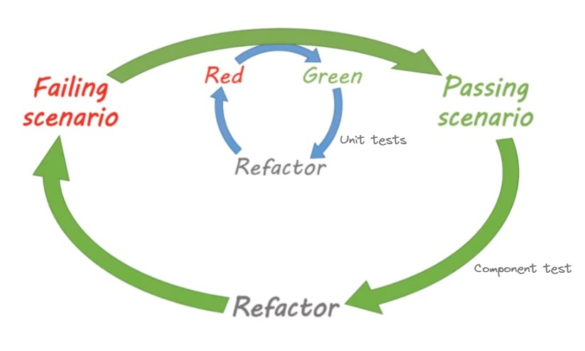

# Reprendre la main sur mon backend Node (Testing & refactoring)

## Résolution libre

Cette page détaille les consignes pour faire le kata de manière libre.

Pour une résolution plus guidée (orientée POO), allez sur [cette page](README.md).

## Slides

Ce kata a été proposé en atelier à [Tech N Wine](https://technwine.fr/) 2024.

[Les slides sont disponibles ici.](assets/slides_fr.pdf)

## Objectif

L'objectif de cet atelier est d'améliorer un backend NodeJS et de manipuler différents types de tests :

- end-to-end
- de composants
- d'intégration
- unitaires

Pour cela, nous serons amené à utiliser les outils Vitest, Supertest et Testcontainers.

Nous avancerons étape par étape dans l'ajout de ces types de tests.
Ceci nous permettra de refactorer progressivement la base de code.

Nous ajouterons finalement quelques features en double loop TDD.

## Prérequis

- Un IDE configuré pour coder en TypeScript
- Une connexion Internet
- NodeJS & npm
- Docker
- L'image Docker Mongo `mongo:7.0.6`
    - Vous pouvez la précharger via la commande : `docker image pull mongo:7.0.6`
- Un client HTTP REST :
    - VS Code : https://marketplace.visualstudio.com/items?itemName=humao.rest-client
    - Webstorm : https://www.jetbrains.com/help/webstorm/http-client-in-product-code-editor.html
    - IDEA : https://www.jetbrains.com/help/idea/http-client-in-product-code-editor.html
- Clonez le repo et installez les dépendances avec la commande `npm install`

## Description

L'application est un backend NodeJS / Express qui permet de gérer des comptes bancaires.
Il est possible de créer un compte, d'effectuer des dépots et des retraits d'argent, et de consulter le solde en euros
et en yens.

L'application nécessite une base de données Mongo pour fonctionner. En local, installez Docker et lancer les commandes
suivantes :

```
mkdir ~/data  
docker run -d -p 27017:27017 -v ~/data:/data/db mongo:7.0.6
```

Il est aussi nécessaire d'être connecté à Internet car l'application dépend de l'API tierce Frankfurter.

## Tests

Pour le moment, l'application est testée manuellement uniquement.

Pour tester :

- Démarrez la base de données
- Lancez le serveur en local `npm run dev`
- Utilisez le fichier `Request.http` et le plugin HTTP Client pour effectuer des requêtes


## Etape 1 : Couvrir le code actuel

Le but de cette étape et de découvrir comment réaliser facilement des tests avec Supertest en couvrant l'application
existante.

Pour ne pas ajouter de complexité et obtenir rapidement une bonne couverture, nous mettrons en place des tests
end-to-end un peu particuliers. En effet, contrairement à des tests end-to-end "classiques", on ne build pas
l'application et on ne la lance pas pour la tester. On utilise Supertest pour tester en boîte blanche et simuler des
appels aux routes, sans démarrer l'application.

Voici les consignes :

- Démarrez une instance de Mongo dans un conteneur Docker
- Ne lancez pas trop souvent les tests qui utilisent l'API Frankfurter (utilisez `it.skip` pour désactiver
  un test)
- `Application.ts` n'est pas encore couvert par des tests, ne modifiez son code que si cela est vraiment nécessaire
- Les tests sont à rédiger dans le fichier `tests-e2e/Accounts.spec.ts`
- Vous pouvez travailler avec un feedback continu sur les tests e2e via la commande `npm run test:e2e`
- Commencez par compléter le test existant, et vérifiez la couverture de code
- Implémentez ensuite le test suggéré, vérifiez la couverture de code
- Pensez à une stratégie pour nettoyer régulièrement la base de données
- Une fois ces étapes réalisées, ajoutez des tests pour atteindre une couverture maximale

Notes :

- Ne cherchez pas à tester la méthode `start()` de la classe `Application`
- Utilisez le mode UI de Vitest pour vérifier la couverture de code avec plus de confort
- Il est possible de lancer le serveur via `npm run dev` et d'utiliser le fichier `Requests.http` pour tester les
  requêtes et obtenir des exemples de réponses.
- Mongo n'accepte que les id avec un format spécifique (hex string de longueur 24, ex : `6645b7ae2d4e3ffe018f0ba2`).

## Etape 2 : Se découpler de l'API et de la base de données

Les appels à l'API Frankfurter sont coûteux (traffic réseau, nombre de requêtes limitées).
Les appels à la base de données sont lourds (temps de requête, avoir une base qui tourne en parallèle).

L'étape suivante sera donc d'isoler notre application de ces services externes et d'écrire des tests de composants.

Ces tests auront une couverture inférieure (ils ne testeront pas les appels à la DB ni à l'API) mais seront bien plus
légers.

Consignes :

- La commande `npm run test:component` permet d'exécuter uniquement les tests de composant localisés
  dans le dossier `tests-component`
- Refactorez le code pour pouvoir tester via les tests de composant sans dépendences avec Mongo et Frankfurter
- Prenez garde à ne pas mettre de logique métier dans le code isolé
- La refacto ne doit pas casser les tests e2e, et ceux-ci doivent continuer à tester avec l'API et la base de données

Notes :

- Vous pouvez lancer la commande `npm run test:all` pour exécuter l'ensemble des tests et vérifier la couverture globale
- Il faudra utiliser des doublures de tests pour les tests de composant, déterminez les doublures les plus pertinentes

### Etape 3 : Isoler les règles métier

Le but de cette étape est d'isoler les règles métier. À la fin de cette étape, il ne doit rester que du code spécifique
à Express et à l'API REST dans `Application.ts`.

On souhaite par ailleurs mettre en évidence les fonctionnalités de l'application.

Consignes :

- Utilisez les tests de composant pour sécuriser votre refactoring (`npm run test:component`)
- Screaming architecture : faites apparaître les fonctionnalités offertes par l'application via les fichiers que vous
  allez créer :
    - Isolez la création de compte bancaire dans un ficher `domain/CreateAccount.ts`
    - Isolez le dépôt d'argent dans un ficher `domain/MakeDeposit.ts`
    - Isolez le retrait d'argent dans un ficher `domain/MakeWithdraw.ts`
    - Isolez la consultation du solde (en euros ou en yens) dans un ficher `domain/ComputeBalance.ts`

### Etape 4 : Ajouter des règles métier

Le but de cette étape est d'ajouter les règles métier suivantes :

- On ne peut pas retirer d'argent si l'opération rend le solde négatif
- Un dépôt ou un retrait doit toujours avoir un montant positif ou nul

On souhaite réaliser cette étape en double loop TDD. Pour cela, on écrit un test de composant qui illustre une nouvelle
règle. Ce test restera rouge tant que la fonctionnalité ne sera pas implémentée. Puis, on implémente la fonctionnalité
en TDD via des tests unitaires.



Consignes :

- Implémentez la première règle en double loop TDD :
    - Commencez par écrire un test de composant qui échoue, il consititue la grande boucle
    - Implémentez la fonctionnalité en TDD avec les tests unitaires `npm run test:unit`
    - Vérifiez que votre grande boucle est bien verte
- Implémentez la seconde règle en double loop TDD

### Etape 5 : Ajouter des tests d'intégration

On veut créer des tests pour valider le comportement du code lié à la base de données et à l'API Frankfurter.

Consignes :

- Utilisez TestContainers pour gérer une base de données par le code de tests
- Créez un dossier `tests-integration` pour lancer ces tests indépendamment des autres avec la
  commande `npm run test:integration`
- Attention à ne pas lancer les tests liés à l'API Frankfurter trop souvent !

### Etape 6 : Bilan

- Consultez le bilan du kata en allant sur la branche `end`


