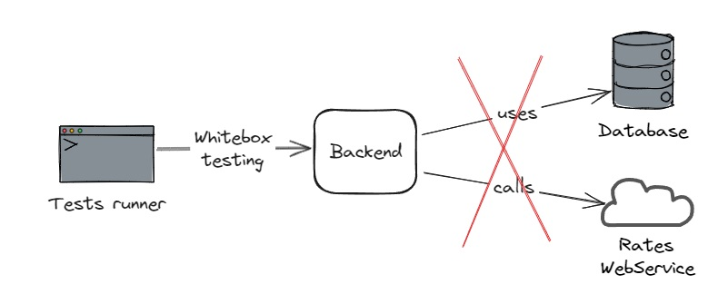
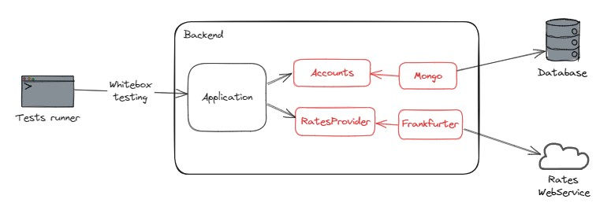
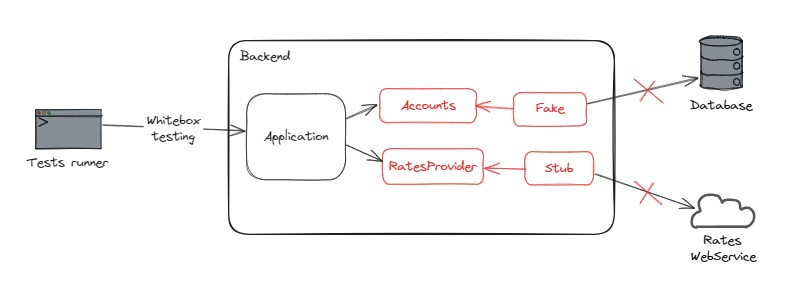

# Reprendre la main sur mon backend Node (Testing & refactoring)

## Description

L'application est un backend NodeJS / Express qui permet de gérer des comptes bancaires.
Il est possible de créer un compte, d'effectuer des dépots et des retraits d'argent, et de consulter le solde en euros
et en yens.

Pour lancer une base de données Mongo avec Docker :

```
mkdir ~/data  
docker run -d -p 27017:27017 -v ~/data:/data/db mongo:7.0.6
```

## Tests

<details>
  <summary>Les types de test disponibles</summary>

### Manuels

Pour tester manuellement l'application :

- Démarrez la base de données
- Lancez le serveur en local `npm run dev`
- Utilisez le fichier `Request.http` et le plugin HTTP Client pour effectuer des requêtes


### End-to-end (e2e)

Pour tester l'application :

- Démarrez la base de données
- Lancez les test `npm run test:e2e`

Les tests end-to-end sont des tests pour lesquels l'application est connectée à ses dépendances externes. Ils sont
lents, coûteux et fragiles à cause de ces dépendances, mais ils permettent de valider des cas d'usage complets. De ce
fait, on évite d'en écrire beaucoup et on souhaite se limiter aux cas critiques.

Dans notre cas, ce ne sont pas réellement des tests e2e dans le sens ou l'application ne tourne pas, et on n'utilise pas
de client HTTP pour effectuer les requêtes. Les tests devraient par ailleurs se charger de démarrer et d'arrêter la base
de données.
Mais cela est suffisant pour notre besoin actuel.


</details>

## Etape 2 : Se découpler de l'API et de la base de données

Les appels à l'API Frankfurter sont coûteux (traffic réseau, nombre de requêtes limitées).
Les appels à la base de données sont lourds (temps de requête, avoir une base qui tourne en parallèle).

L'étape suivante sera donc d'isoler notre application de ces services externes et d'écrire des tests de composants.



Ces tests auront une couverture inférieure (ils ne testeront pas les appels à la DB ni à l'API) mais seront bien plus
légers.

Consignes :

- `npm run test:e2e` n'est plus en watch mode pour limiter les appels à l'API Frankfurter
- La commande `npm run test:component` permet d'exécuter uniquement les tests de composant présents
  dans `tests-component` (il s'agit pour le moment d'une copie des tests end-to-end avec le test utilisant Frankfurter
  désactivé)
- Refactorez le code pour pouvoir tester via les tests de composant sans dépendences avec Mongo et Frankfurter
- Prenez garde à ne pas mettre de logique métier dans le code isolé
- La refacto ne doit pas casser les tests e2e, et ceux-ci doivent continuer à tester avec l'API et la base de données
- Passez ensuite à l'étape suivante en allant sur la branche `step-3-start`

Notes :

- Vous pouvez lancer la commande `npm run test:all` pour exécuter l'ensemble des tests et vérifier la couverture globale
- Il faudra utiliser des doublures de tests pour les tests de composant, déterminez les doublures les plus pertinentes

<details>
  <summary>Résolution guidée</summary>

Il est nécessaire d'isoler le code relatif à Mongo et à l'API Frankfurter, puis de créer une abstraction via une
interface afin de pouvoir utiliser des doublures de test dans les tests de composant.

Voici les transformations à effectuer pour les tests e2e :



Et les transformations à effectuer pour les tests de composant :



Résolution pas-à-pas pour l'isolation de l'API Frankfurter :

- Isolez le code relatif à l'API Fankfurter dans une méthode de la classe Application (puis lancez les tests
  e2e `npm run test:e2e`)
- Créez une interface `RatesProvider` qui défini une méthode avec la même signature
- Implémentez cette interface avec une classe `FrankfurterRatesProvider`, et copiez le code isolé
- Ajoutez en membre privé à la classe Application un `ratesProvider` qui est pour le moment
  un `FrankfurterRatesProvider`
- Branchez le code de `Application` à `ratesProvider` et vérifiez que les tests sont toujours verts (puis lancez les
  tests e2e `npm run test:e2e`)
- Supprimez le code devenu inutile dans `Application` (puis lancez les tests e2e `npm run test:e2e`)
- Modifiez le constructeur de `Application` pour injecter un `RatesProvider` et définir le membre `ratesProvider`
- Réparez les tests de manière à compiler (puis lancez les tests e2e `npm run test:e2e`)
- Réparez le fichier `Main.ts` de manière à compiler avec un `FrankfurterRatesProvider` (puis lancez le serveur
  avec `npm run dev`)
- Lancez les tests de composant `npm run test:component` et réparez le fichier de tests pour qu'il compile
  avec `FrankfurterRatesProvider`
- Créez un stub de `RatesProvider` et utilisez-le dans les tests de composant, et rendez le test avec la devise JPY
  déterministe

Pour créer un mock avec `vitest-mock-extended` :

```js
import {mock} from "vitest-mock-extended";

const testDouble = mock < MyInterface > (); // Create mock object based on an interface

testDouble.methodOfMyInterface.mockResolvedValue(10); // Stub an async method
testDouble.methodOfMyInterface.mockReturnValue(10); // Stub a sync method
```

Puis reproduisez cette logique avec le code relatif à MongoDB. Utilisez cette fois-ci un fake in-memory.

</details>