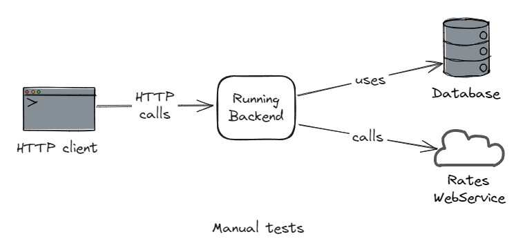
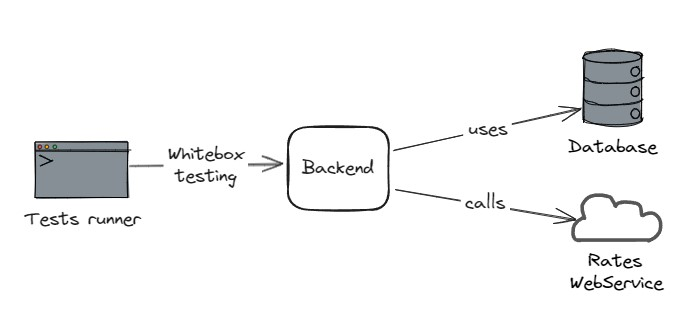
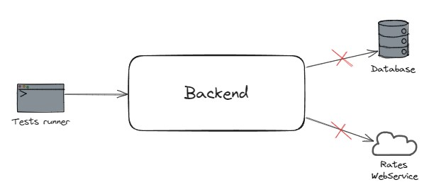

# Reprendre la main sur mon backend Node (Testing & refactoring)

## Description

L'application est un backend NodeJS / Express qui permet de gérer des comptes bancaires.
Il est possible de créer un compte, d'effectuer des dépots et des retraits d'argent, et de consulter le solde en euros
et en yens.

Pour lancer une base de données Mongo avec Docker :

```
mkdir ~/data  
docker run -d -p 27017:27017 -v ~/data:/data/db mongo:7.0.6
```

## Tests

<details>
  <summary>Les types de test disponibles</summary>

### Manuels

Pour tester manuellement l'application :

- Démarrez la base de données
- Lancez le serveur en local `npm run dev`
- Utilisez le fichier `Request.http` et le plugin HTTP Client pour effectuer des requêtes



### End-to-end (e2e)

Pour tester l'application :

- Démarrez la base de données
- Lancez les test `npm run test:e2e`

Les tests end-to-end sont des tests pour lesquels l'application est connectée à ses dépendances externes. Ils sont
lents, coûteux et fragiles à cause de ces dépendances, mais ils permettent de valider des cas d'usage complets. De ce
fait, on évite d'en écrire beaucoup et on souhaite se limiter aux cas critiques.

Dans notre cas, ce ne sont pas réellement des tests e2e dans le sens ou l'application ne tourne pas, et on n'utilise pas
de client HTTP pour effectuer les requêtes. Les tests devraient par ailleurs se charger de démarrer et d'arrêter la base
de données.
Mais cela est suffisant pour notre besoin actuel.



### Composants

Pour tester l'application : `npm run test:component`

Les tests de composants sont des tests pour lesquels l'application est isolée de ses interactions avec ses dépendances
externes.

Ces tests ne couvrent pas les appels à l'API ni à la base de données.
Ils sont cependant bien plus rapides à exécuter et donnent un feedback instantané sur une bonne surface de
l'application.



### Unitaires

Pour tester : `npm run test:unit`

</details>

### Etape bonus : Ajouter des tests d'intégration

On veut créer des tests pour valider le comportement du code lié à la base de données et à l'API Frankfurter.

Consignes :

- Utilisez TestContainers pour gérer une base de données par le code de tests
- Créez un dossier `tests-integration` pour lancer ces tests indépendamment des autres avec la
  commande `npm run test:integration`
- Attention à ne pas lancer les tests liés à l'API Frankfurter trop souvent !
- Consultez le bilan du kata en allant sur la branche `end`
