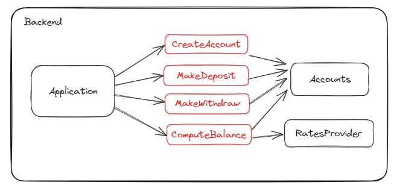

# Reprendre la main sur mon backend Node (Testing & refactoring)

## Description

L'application est un backend NodeJS / Express qui permet de gérer des comptes bancaires.
Il est possible de créer un compte, d'effectuer des dépots et des retraits d'argent, et de consulter le solde en euros
et en yens.

Pour lancer une base de données Mongo avec Docker :

```
mkdir ~/data  
docker run -d -p 27017:27017 -v ~/data:/data/db mongo:7.0.6
```

## Tests

<details>
  <summary>Les types de test disponibles</summary>

### Manuels

Pour tester manuellement l'application :

- Démarrez la base de données
- Lancez le serveur en local `npm run dev`
- Utilisez le fichier `Request.http` et le plugin HTTP Client pour effectuer des requêtes


### End-to-end (e2e)

Pour tester l'application :

- Démarrez la base de données
- Lancez les test `npm run test:e2e`

Les tests end-to-end sont des tests pour lesquels l'application est connectée à ses dépendances externes. Ils sont
lents, coûteux et fragiles à cause de ces dépendances, mais ils permettent de valider des cas d'usage complets. De ce
fait, on évite d'en écrire beaucoup et on souhaite se limiter aux cas critiques.

Dans notre cas, ce ne sont pas réellement des tests e2e dans le sens ou l'application ne tourne pas, et on n'utilise pas
de client HTTP pour effectuer les requêtes. Les tests devraient par ailleurs se charger de démarrer et d'arrêter la base
de données.
Mais cela est suffisant pour notre besoin actuel.


### Composants

Pour tester l'application : `npm run test:component`

Les tests de composants sont des tests pour lesquels l'application est isolée de ses interactions avec ses dépendances
externes.

Ces tests ne couvrent pas les appels à l'API ni à la base de données.
Ils sont cependant bien plus rapides à exécuter et donnent un feedback instantané sur une bonne surface de
l'application.


</details>

### Etape 3 : Isoler les règles métier

Le but de cette étape est d'isoler les règles métier. À la fin de cette étape, il ne doit rester que du code spécifique
à Express et à l'API REST dans `Application.ts`.

On souhaite par ailleurs mettre en évidence les fonctionnalités de l'application.

Objectif :



Consignes :

- Utilisez les tests de composant pour sécuriser votre refactoring (`npm run test:component`)
- Screaming architecture : faites apparaître les fonctionnalités offertes par l'application via les fichiers que vous
  allez créer :
    - Isolez la création de compte bancaire dans un ficher `domain/CreateAccount.ts`
    - Isolez le dépôt d'argent dans un ficher `domain/MakeDeposit.ts`
    - Isolez le retrait d'argent dans un ficher `domain/MakeWithdraw.ts`
    - Isolez la consultation du solde (en euros ou en yens) dans un ficher `domain/ComputeBalance.ts`
- Effectuez au moins une de ces isolations puis allez sur la branche `step-4-start` pour continuer

<details>
  <summary>Résolution guidée</summary>

- Lancez les tests de composant `npm run test:component`
- Isolez le cas d'usage "CreateAccount" :
    - Isolez le code dédié à lire dans la requête REST les informations nécessaires (déjà fait)
    - Isolez le code dédié à construire la réponse REST, basé sur le retour du cas d'usage (déjà fait)
    - Utilisez une extraction de méthode pour isoler le cas d'usage dans une nouvelle méthode de la classe `Application`
    - Créez une nouvelle classe `domain/CreateAccount.ts`
    - Ajoutez une méthode `act()` dont le corps est une copie du cas d'usage isolé précédemment
    - Ce code nécessite une instance de `Accounts` pour fonctionner, créez un constructeur pour injecter cet élément
    - Injectez une instance de `CreateAccount` dans la classe `Application`
    - Modifier le code des tests de composant pour réparer la compilation
    - Branchez l'instance de `CreateAccount` dans la classe `Application`, puis supprimez la méthode obsolète
    - Réparez les tests e2e
    - Réparez `Main.ts`
    - Vérifiez l'ensemble de vos tests `npm run test:all`
    - Vérifiez que le serveur démarre toujours `npm run dev`
- Implémentez de la même façon les autres cas d'usage

</details>

