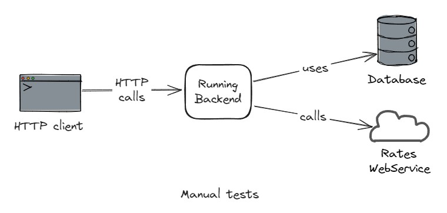
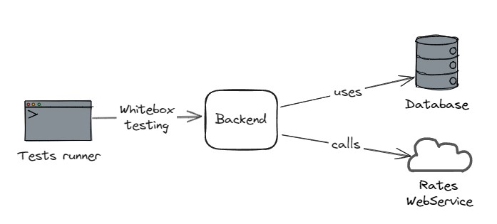
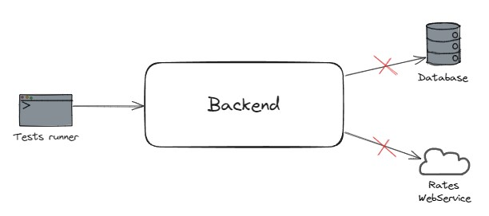

# Reprendre la main sur mon backend Node (Testing & refactoring)

## Objectif

L'objectif de cet atelier est d'améliorer un backend NodeJS et de manipuler différents types de tests :

- end-to-end
- de composants
- d'intégration
- unitaires

Pour cela, nous serons amené à utiliser les outils Vitest, Supertest et Testcontainers.

Nous avancerons étape par étape dans l'ajout de ces types de tests.
Ceci nous permettra de refactorer progressivement la base de code.

Nous ajouterons finalement quelques features en double loop TDD.

## Prérequis

- Un IDE configuré pour coder en TypeScript
- Une connexion Internet
- NodeJS & npm
- Docker
- L'image Docker Mongo `mongo:7.0.6`
    - Vous pouvez la précharger via la commande : `docker image pull mongo:7.0.6`
- Un client HTTP REST :
    - VS Code : https://marketplace.visualstudio.com/items?itemName=humao.rest-client
    - Webstorm : https://www.jetbrains.com/help/webstorm/http-client-in-product-code-editor.html
    - IDEA : https://www.jetbrains.com/help/idea/http-client-in-product-code-editor.html
- Clonez le repo et installez les dépendances avec la commande `npm install`

## Description

L'application est un backend NodeJS / Express qui permet de gérer des comptes bancaires.
Il est possible de créer un compte, d'effectuer des dépots et des retraits d'argent, et de consulter le solde en euros
et en yens.

Pour lancer une base de données Mongo avec Docker :

```
mkdir ~/data  
docker run -d -p 27017:27017 -v ~/data:/data/db mongo:7.0.6
```

Il est aussi nécessaire d'être connecté à Internet car l'application dépend de l'API tierce Frankfurter.

## Tests

<details>
  <summary>Les types de test disponibles</summary>

### Manuels

Pour tester manuellement l'application :

- Démarrez la base de données
- Lancez le serveur en local `npm run dev`
- Utilisez le fichier `Request.http` et le plugin HTTP Client pour effectuer des requêtes



### End-to-end (e2e)

Pour tester l'application :

- Démarrez la base de données
- Lancez les test `npm run test:e2e`

Les tests end-to-end sont des tests pour lesquels l'application est connectée à ses dépendances externes. Ils sont
lents, coûteux et fragiles à cause de ces dépendances, mais ils permettent de valider des cas d'usage complets. De ce
fait, on évite d'en écrire beaucoup et on souhaite se limiter aux cas critiques.

Dans notre cas, ce ne sont pas réellement des tests e2e dans le sens ou l'application ne tourne pas, et on n'utilise pas
de client HTTP pour effectuer les requêtes. Les tests devraient par ailleurs se charger de démarrer et d'arrêter la base
de données.
Mais cela est suffisant pour notre besoin actuel.



### Composants

Pour tester l'application : `npm run test:component`

Les tests de composants sont des tests pour lesquels l'application est isolée de ses interactions avec ses dépendances
externes.

Ces tests ne couvrent pas les appels à l'API ni à la base de données.
Ils sont cependant bien plus rapides à exécuter et donnent un feedback instantané sur une bonne surface de
l'application.



### Unitaires

Pour tester : `npm run test:unit`

</details>
