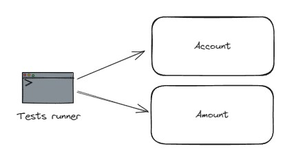

# Bilan

## Architecture hexagonale

### Présentation

L'architecture hexagonale est une architecture qui vise à protéger le domain en le mettant au centre des préoccupations
et de le découpler de détails d'implémentations liés à la technologie (librairies, frameworks, dépendances externes...).

Le domain, qui regroupe l'ensemble des règles métier de l'application, est composé de code uniquement dépendant du
langage. Dans ce kata, le domain est en JS/TS pur et ne dispose d'aucune dépendances vers des technologies comme
ExpressJS, Mongo ou un client HTTP.
Ceci permet de tester facilement les règles métier qui constituent la valeur de notre application.

Les adapters primaires sont les points d'entrée de l'application.
Ils pilotent le domain.
Dans notre cas, il s'agit d'un serveur REST, mais cela pourrait être une IHM, une CLI ou encore une API de librairie.

Les adapters secondaires sont des besoins techniques à satisfaire pour que l'application puisse fonctionner.
Ils sont pilotés par le domain.
Le domain exprime un besoin via des ports (en vert sur le schéma) qui sont des interfaces, et les adapters sont des
implémentations de ces ports.
On utilise ici le principe d'inversion de dépendances de SOLID pour permettre au domain de ne plus être dépendant de la
technologie.

Les adapters primaires et secondaires sont facilement échangeable par d'autres adapters.
Il est par exemple facile de brancher un autre type de base de données sans risquer de casser une autre zone de
l'application, et en particulier, le domain.

### Architecture émergeante

En respectant le principe de responsabilité unique de SOLID, ce kata nous amène à faire émerger cette architecture.

En effet, l'isolation des connecteurs vers la base de données et l'API Frankfurter a fait apparaître deux adapters
secondaires.

La volonté d'isoler le code relatif à REST a fait apparaître l'adapter primaire.

Il ne restait alors qu'à créer la bonne arborescence de dossiers pour faire apparaître les trois couches de l'
architecture hexagonale, en prenant soin à bien placer les ports dans le domain.

## Types de tests automatisés

### Tests end-to-end (e2e)

Les tests end-to-end sont des tests pour lesquels l'application est au plus proche de ses conditions de production. Elle
est notamment connectée à ses dépendances externes.

Ces tests sont lents, coûteux et fragiles, mais ils permettent de valider des cas d'usage
de bout en bout. De ce fait, on évite d'en écrire beaucoup et on se limite aux cas critiques.

Dans notre cas, nous n'avons pas réellement de tests e2e dans le sens où l'application n'est ni buildée, ni lancée.
Par ailleurs, l'utilisation de Supertest ne constitue pas un vrai client HTTP qui effectue des vraies requêtes.
Ces tests requièrent aussi d'avoir une base de données qui fonctionne en amont.

Pour effectuer des tests e2e plus corrects, on pourrait builder l'application dans une image Docker et utiliser
TestContainers pour démarrer à la fois l'application et la base de données, puis émettre des appels HTTPS depuis notre
tests runner via un client HTTP comme Axios ou node-fetch:

Les tests e2e interagissent avec l'application via ses adapters primaires et l'application est reliée à ses dépendances
externes via ses adapters secondaires.

### Tests de composants

Les tests de composants sont des tests pour lesquels l'application est isolée de ses interactions avec ses dépendances
externes.

Ces tests ne couvrent pas les appels à l'API ni à la base de données.
Ils sont cependant bien plus rapides à exécuter et donnent un feedback instantané sur une bonne surface de
l'application.

Pour ce type de tests, on utilise des doublures de tests à la place des adapters secondaires.

On peut manipuler l'application en se branchant aux adapters primaires ou directement au domain si on souhaite alléger
ces tests (dans ce cas, utiliser d'autres types de tests pour couvrir le code des adapters primaires).

### Tests d'intégration

Les tests d'intégration sont des tests destinés à vérifier notre utilisation d'outils, libs et services externes dont
dépend notre application.

Ces tests peuvent être lourds et/ou coûteux, c'est pourquoi on souhaite limiter le périmètre des éléments testés au
maximum. On s'assure que ces éléments respectent bien le principe de responsabilité unique (ex : un connecteur vers une
base de données ne doit pas contenir de logique métier).

Ces tests valident le comportement des adapters secondaires.

Ils peuvent aussi permettre de valider les adapter primaires en utilisant des doublures de tests à la place du domain.

### Tests unitaires

Les tests unitaires sont des tests destinés à couvrir des unités fonctionnelles sans dépendances externes.

Ils sont très rapides à exécuter et donnent un feedback immédiat.

Ces tests valident le comportement du domain et la logique d'adaptation présente dans les adapters primaires et
secondaires.

## Concepts abordés

- Tests runner : Vitest, mode UI, code coverage, watcher mode
- Supertest : un outil pratique pour tester facilement un backend Express
- TestContainers : un outil pratique pour manipuler des conteneurs et faciliter l'écriture de tests e2e et d'intégration
- Doublures de test :
    - Stub : bouchon qui remplace un élément, on peut définir les valeurs que le bouchon doit retourner
    - Fake : implémentation alternative plus simple d'un élément existant pour alléger un test
- Injection de dépendance : permet de tester plus facilement en permettant de remplacer une dépendance par une autre
- SRP (SOLID) : principe qui fait émerger l'architecture naturellement et qui simplifie le code
- DIP (SOLID) : principe qui permet d'inverser la dépendance entre domain et adapters secondaires, et d'isoler le domain
- Screaming architecture : faire apparaitre le domaine métier et les fonctionnalités via le naming
- Double loop TDD : Utiliser deux boucles de tests pour développer une fonctionnalité

## Ouvertures

- Stratégies de tests : pyramid, diamond, honeycomb, trophy...
- Mieux gérer les dates et le générateur de UUID
- Primitive obsession
- Immutable
- Aggregate / Entity / Value Object
- Event sourcing / CQRS
- ...