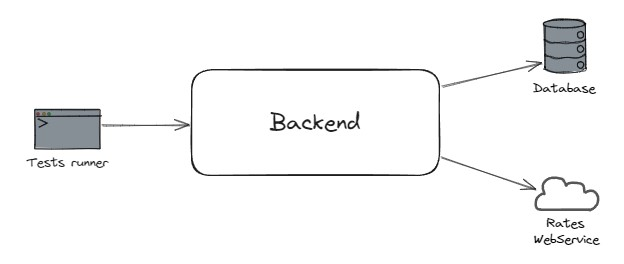

# Reprendre la main sur mon backend Node (Testing & refactoring)

## Description

L'application est un backend NodeJS / Express qui permet de gérer des comptes bancaires.
Il est possible de créer un compte, d'effectuer des dépots et des retraits d'argent, et de consulter le solde en euros
et en yens.

Pour lancer une base de données Mongo avec Docker :

```
mkdir ~/data  
docker run -d -p 27017:27017 -v ~/data:/data/db mongo:7.0.6
```

## Tests

<details>
  <summary>Les types de test disponibles</summary>

### Manuels

Pour tester manuellement l'application :

- Démarrez la base de données
- Lancez le serveur en local `npm run dev`
- Utilisez le fichier `Request.http` et le plugin HTTP Client pour effectuer des requêtes


### End-to-end (e2e)

Pour tester l'application :

- Démarrez la base de données
- Lancez les test `npm run test:e2e`

Les tests end-to-end sont des tests pour lesquels l'application est connectée à ses dépendances externes. Ils sont
lents, coûteux et fragiles à cause de ces dépendances, mais ils permettent de valider des cas d'usage complets. De ce
fait, on évite d'en écrire beaucoup et on souhaite se limiter aux cas critiques.

Dans notre cas, ce ne sont pas réellement des tests e2e dans le sens ou l'application ne tourne pas, et on n'utilise pas
de client HTTP pour effectuer les requêtes. Les tests devraient par ailleurs se charger de démarrer et d'arrêter la base
de données.
Mais cela est suffisant pour notre besoin actuel.



### Composants

Pour tester l'application : `npm run test:component`

Les tests de composants sont des tests pour lesquels l'application est isolée de ses interactions avec ses dépendances
externes.

Ces tests ne couvrent pas les appels à l'API ni à la base de données.
Ils sont cependant bien plus rapides à exécuter et donnent un feedback instantané sur une bonne surface de
l'application.


</details>

### Etape 4 : Ajouter des règles métier

Le but de cette étape est d'ajouter les règles métier suivantes :

- On ne peut pas retirer d'argent si l'opération rend le solde négatif
- Un dépôt ou un retrait doit toujours avoir un montant positif ou nul

On souhaite réaliser cette étape en double loop TDD. Pour cela, on écrit un test de composant qui illustre une nouvelle
règle. Ce test restera rouge tant que la fonctionnalité ne sera pas implémentée. Puis, on implémente la fonctionnalité
en TDD via des tests unitaires.


Consignes :

- Implémentez la première règle en double loop TDD :
    - Un test de composant a été ajouté et constitue la première loop, ce test est
      rouge (`should not withdraw if not enough money available`).
    - Lancez les tests unitaires via la commande `npm run test:unit`, cette commande lance les tests présents dans le
      dossier `tests-unit`
    - Complétez le test écrit dans `tests-unit/Account.spec.ts` de manière à implémenter ce comportement, ce test
      constitue
      la seconde loop
    - Vérifiez que le test de composant est vert
    - N'oubliez pas de refactorer le code si nécessaire
- Implémentez la seconde règle en double loop TDD
- Optionnel : étape bonus - ajouter des tests d'intégration : allez sur la branche `bonus-integration-tests-start`
- Consultez le bilan du kata en allant sur la branche `end`

<details>
  <summary>Résolution guidée</summary>

Pour résoudre la première fonctionnalité, nous devons calculer le solde dans MakeWithdraw et nous assurer qu'il ne
devient pas négatif.

Il existe déjà du code responsable de calculer le solde dans `ComputeBalance`. Commençons par factoriser cette
logique, dans l'idéal dans la classe Account, car c'est elle qui possède les informations nécéssaires à ce calcul.

De même, nous allons déplacer le code responsable de faire un retrait dans la classe Account qui est détentrice des
transactions.

Nous commençons par une phase de refactoring pour faciliter l'ajout de cette fonctionnalité :

- Lancez les tests de composant `npm run test:component`
- Désactivez le test de la grande boucle qui est en échec
- Ajoutez une méthode `balance()` dans la classe `Account` et copiez le code responsable de faire ce calcul depuis la
  classe `ComputeBalance`
- Modifiez `ComputeBalance` pour utiliser cette nouvelle méthode
- Ajoutez une méthode `withdraw()` dans la classe `Account` et copiez le code responsable de faire un retrait depuis la
  classe `MakeWithdraw`
- Modifiez `MakeWithdraw` pour utiliser cette nouvelle méthode
- Réactivez le test de la grande boucle qui est en échec
- Lancez les tests unitaires `npm run test:unit`
- Complétez le test dans `Account.spec.ts`
- Ecrivez le code nécessaire pour le faire passer le test unitaire
- Refactorez le code si nécessaire
- Lancez à nouveau les tests de composant `npm run test:component` et assurez-vous qu'ils soient vert
- Refactorez le code si nécessaire

Pour la seconde règle, nous allons utiliser une nouvelle classe `Amount` qui possèdera une vérification dans son
constructeur.

- Lancez les tests de composant `npm run test:component`
- Ajoutez un nouveau test qui vérifie qu'on ne peut pas faire un dépôt d'un montant négatif
- Le test est rouge, il constitue la grande boucle
- Lancez les tests unitaires `npm run test:unit`
- Créez un fichier de test `tests-unit/domain/Amount.spec.ts`
- Ajoutez un test qui s'assure que construire une instance avec 0 lance une erreur
- Implémentez le code nécessaire à faire passer ce test et refactorez si nécessaire
- Ajouter un autre test qui s'assure que construire une instance avec -5 lance une erreur
- Implémentez le code nécessaire à faire passer ce test et refactorez si nécessaire
- Lancez les tests de composant `npm run test:component`
- Branchez la classe `Amount` de manière à faire passer le testg

</details>