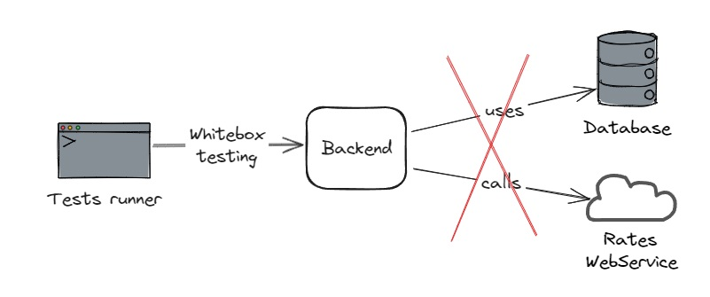
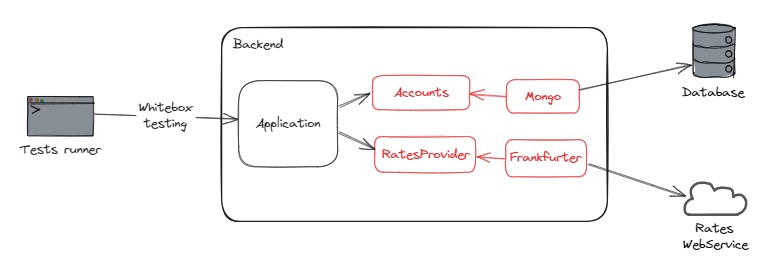
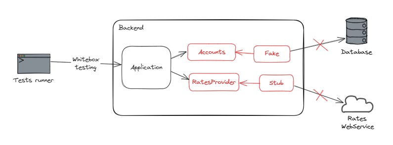
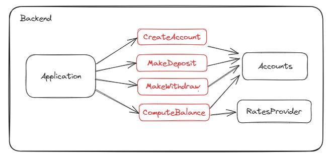
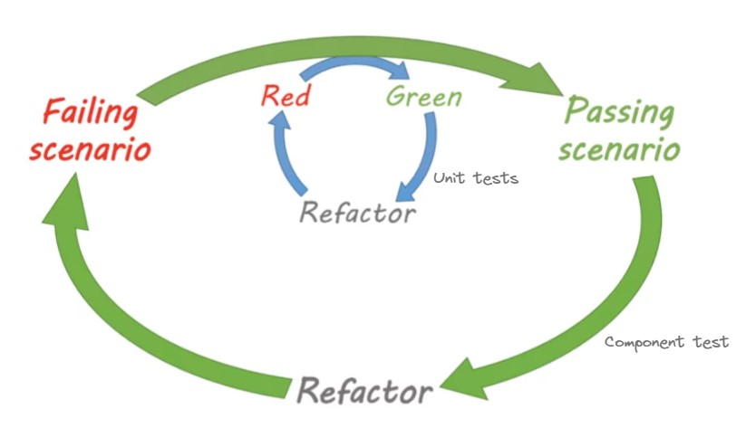

# Etapes

## Etape 1 : Couvrir le code actuel

Branche : main

Le but de cette étape et de découvrir comment réaliser facilement des tests avec Supertest en couvrant l'application
existante.

Pour ne pas ajouter de complexité et obtenir rapidement une bonne couverture, nous mettrons en place des tests
end-to-end un peu particuliers. En effet, contrairement à des tests end-to-end "classiques", on ne build pas
l'application et on ne la lance pas pour la tester. On utilise Supertest pour tester en boîte blanche et simuler des
appels aux routes, sans démarrer l'application.

Voici les consignes :

- Démarrez une instance de Mongo dans un conteneur Docker
- Ne lancez pas trop souvent les tests qui utilisent l'API Frankfurter (utilisez `it.skip` pour désactiver
  un test)
- `Application.ts` n'est pas encore couvert par des tests, ne modifiez son code que si cela est vraiment nécessaire
- Les tests sont à rédiger dans le fichier `tests-e2e/Accounts.spec.ts`
- Vous pouvez travailler avec un feedback continu sur les tests e2e via la commande `npm run test:e2e`
- Commencez par compléter le test existant, et vérifiez la couverture de code
- Implémentez ensuite le test suggéré, vérifiez la couverture de code
- Pensez à une stratégie pour nettoyer régulièrement la base de données
- Une fois ces étapes réalisées, ajoutez des tests pour atteindre une couverture maximale

Notes :

- Ne cherchez pas à tester la méthode `start()` de la classe `Application`
- Utilisez le mode UI de Vitest pour vérifier la couverture de code avec plus de confort
- Il est possible de lancer le serveur via `npm run dev` et d'utiliser le fichier `Requests.http` pour tester les
  requêtes et obtenir des exemples de réponses.
- Mongo n'accepte que les id avec un format spécifique (hex string de longueur 24, ex : `6645b7ae2d4e3ffe018f0ba2`).

## Etape 2 : Se découpler de l'API et de la base de données

Branche : step-2-start

Les appels à l'API Frankfurter sont coûteux (traffic réseau, nombre de requêtes limitées).
Les appels à la base de données sont lourds (temps de requête, avoir une base qui tourne en parallèle).

L'étape suivante sera donc d'isoler notre application de ces services externes et d'écrire des tests de composants.



Ces tests auront une couverture inférieure (ils ne testeront pas les appels à la DB ni à l'API) mais seront bien plus
légers.

Consignes :

- `npm run test:e2e` n'est plus en watch mode pour limiter les appels à l'API Frankfurter
- La commande `npm run test:component` permet d'exécuter uniquement les tests de composant présents
  dans `tests-component` (il s'agit pour le moment d'une copie des tests end-to-end avec le test utilisant Frankfurter
  désactivé)
- Refactorez le code pour pouvoir tester via les tests de composant sans dépendences avec Mongo et Frankfurter
- Prenez garde à ne pas mettre de logique métier dans le code isolé
- La refacto ne doit pas casser les tests e2e, et ceux-ci doivent continuer à tester avec l'API et la base de données
- Passez ensuite à l'étape suivante en allant sur la branche `step-3-start`

Notes :

- Vous pouvez lancer la commande `npm run test:all` pour exécuter l'ensemble des tests et vérifier la couverture globale
- Il faudra utiliser des doublures de tests pour les tests de composant, déterminez les doublures les plus pertinentes

<details>
  <summary>Résolution guidée</summary>

Il est nécessaire d'isoler le code relatif à Mongo et à l'API Frankfurter, puis de créer une abstraction via une
interface afin de pouvoir utiliser des doublures de test dans les tests de composant.

Voici les transformations à effectuer pour les tests e2e :



Et les transformations à effectuer pour les tests de composant :



Résolution pas-à-pas pour l'isolation de l'API Frankfurter :

- Isolez le code relatif à l'API Fankfurter dans une méthode de la classe Application (puis lancez les tests
  e2e `npm run test:e2e`)
- Créez une interface `RatesProvider` qui défini une méthode avec la même signature
- Implémentez cette interface avec une classe `FrankfurterRatesProvider`, et copiez le code isolé
- Ajoutez en membre privé à la classe Application un `ratesProvider` qui est pour le moment
  un `FrankfurterRatesProvider`
- Branchez le code de `Application` à `ratesProvider` et vérifiez que les tests sont toujours verts (puis lancez les
  tests e2e `npm run test:e2e`)
- Supprimez le code devenu inutile dans `Application` (puis lancez les tests e2e `npm run test:e2e`)
- Modifiez le constructeur de `Application` pour injecter un `RatesProvider` et définir le membre `ratesProvider`
- Réparez les tests de manière à compiler (puis lancez les tests e2e `npm run test:e2e`)
- Réparez le fichier `Main.ts` de manière à compiler avec un `FrankfurterRatesProvider` (puis lancez le serveur
  avec `npm run dev`)
- Lancez les tests de composant `npm run test:component` et réparez le fichier de tests pour qu'il compile
  avec `FrankfurterRatesProvider`
- Créez un stub de `RatesProvider` et utilisez-le dans les tests de composant, et rendez le test avec la devise JPY
  déterministe

Pour créer un mock avec `vitest-mock-extended` :

```js
import {mock} from "vitest-mock-extended";

const testDouble = mock < MyInterface > (); // Create mock object based on an interface

testDouble.methodOfMyInterface.mockResolvedValue(10); // Stub an async method
testDouble.methodOfMyInterface.mockReturnValue(10); // Stub a sync method
```

Puis reproduisez cette logique avec le code relatif à MongoDB. Utilisez cette fois-ci un fake in-memory.

</details>

## Etape 3 : Isoler les règles métier

Branche : step-3-start

Le but de cette étape est d'isoler les règles métier. À la fin de cette étape, il ne doit rester que du code spécifique
à Express et à l'API REST dans `Application.ts`.

On souhaite par ailleurs mettre en évidence les fonctionnalités de l'application.

Objectif :



Consignes :

- Utilisez les tests de composant pour sécuriser votre refactoring (`npm run test:component`)
- Screaming architecture : faites apparaître les fonctionnalités offertes par l'application via les fichiers que vous
  allez créer :
    - Isolez la création de compte bancaire dans un ficher `domain/CreateAccount.ts`
    - Isolez le dépôt d'argent dans un ficher `domain/MakeDeposit.ts`
    - Isolez le retrait d'argent dans un ficher `domain/MakeWithdraw.ts`
    - Isolez la consultation du solde (en euros ou en yens) dans un ficher `domain/ComputeBalance.ts`
- Effectuez au moins une de ces isolations puis allez sur la branche `step-4-start` pour continuer

<details>
  <summary>Résolution guidée</summary>

- Lancez les tests de composant `npm run test:component`
- Isolez le cas d'usage "CreateAccount" :
    - Isolez le code dédié à lire dans la requête REST les informations nécessaires (déjà fait)
    - Isolez le code dédié à construire la réponse REST, basé sur le retour du cas d'usage (déjà fait)
    - Utilisez une extraction de méthode pour isoler le cas d'usage dans une nouvelle méthode de la classe `Application`
    - Créez une nouvelle classe `domain/CreateAccount.ts`
    - Ajoutez une méthode `act()` dont le corps est une copie du cas d'usage isolé précédemment
    - Ce code nécessite une instance de `Accounts` pour fonctionner, créez un constructeur pour injecter cet élément
    - Injectez une instance de `CreateAccount` dans la classe `Application`
    - Modifier le code des tests de composant pour réparer la compilation
    - Branchez l'instance de `CreateAccount` dans la classe `Application`, puis supprimez la méthode obsolète
    - Réparez les tests e2e
    - Réparez `Main.ts`
    - Vérifiez l'ensemble de vos tests `npm run test:all`
    - Vérifiez que le serveur démarre toujours `npm run dev`
- Implémentez de la même façon les autres cas d'usage

</details>

## Etape 4 : Ajouter des règles métier

Branche : step-4-start

Le but de cette étape est d'ajouter les règles métier suivantes :

- On ne peut pas retirer d'argent si l'opération rend le solde négatif
- Un dépôt ou un retrait doit toujours avoir un montant positif ou nul

On souhaite réaliser cette étape en double loop TDD. Pour cela, on écrit un test de composant qui illustre une nouvelle
règle. Ce test restera rouge tant que la fonctionnalité ne sera pas implémentée. Puis, on implémente la fonctionnalité
en TDD via des tests unitaires.



Consignes :

- Implémentez la première règle en double loop TDD :
    - Un test de composant a été ajouté et constitue la première loop, ce test est
      rouge (`should not withdraw if not enough money available`).
    - Lancez les tests unitaires via la commande `npm run test:unit`, cette commande lance les tests présents dans le
      dossier `tests-unit`
    - Complétez le test écrit dans `tests-unit/Account.spec.ts` de manière à implémenter ce comportement, ce test
      constitue
      la seconde loop
    - Vérifiez que le test de composant est vert
    - N'oubliez pas de refactorer le code si nécessaire
- Implémentez la seconde règle en double loop TDD
- Optionnel : étape bonus - ajouter des tests d'intégration : allez sur la branche `bonus-integration-tests-start`
- Consultez le bilan du kata en allant sur la branche `end`

<details>
  <summary>Résolution guidée</summary>

Pour résoudre la première fonctionnalité, nous devons calculer le solde dans MakeWithdraw et nous assurer qu'il ne
devient pas négatif.

Il existe déjà du code responsable de calculer le solde dans `ComputeBalance`. Commençons par factoriser cette
logique, dans l'idéal dans la classe Account, car c'est elle qui possède les informations nécéssaires à ce calcul.

De même, nous allons déplacer le code responsable de faire un retrait dans la classe Account qui est détentrice des
transactions.

Nous commençons par une phase de refactoring pour faciliter l'ajout de cette fonctionnalité :

- Lancez les tests de composant `npm run test:component`
- Désactivez le test de la grande boucle qui est en échec
- Ajoutez une méthode `balance()` dans la classe `Account` et copiez le code responsable de faire ce calcul depuis la
  classe `ComputeBalance`
- Modifiez `ComputeBalance` pour utiliser cette nouvelle méthode
- Ajoutez une méthode `withdraw()` dans la classe `Account` et copiez le code responsable de faire un retrait depuis la
  classe `MakeWithdraw`
- Modifiez `MakeWithdraw` pour utiliser cette nouvelle méthode
- Réactivez le test de la grande boucle qui est en échec
- Lancez les tests unitaires `npm run test:unit`
- Complétez le test dans `Account.spec.ts`
- Ecrivez le code nécessaire pour le faire passer le test unitaire
- Refactorez le code si nécessaire
- Lancez à nouveau les tests de composant `npm run test:component` et assurez-vous qu'ils soient vert
- Refactorez le code si nécessaire

Pour la seconde règle, nous allons utiliser une nouvelle classe `Amount` qui possèdera une vérification dans son
constructeur.

- Lancez les tests de composant `npm run test:component`
- Ajoutez un nouveau test qui vérifie qu'on ne peut pas faire un dépôt d'un montant négatif
- Le test est rouge, il constitue la grande boucle
- Lancez les tests unitaires `npm run test:unit`
- Créez un fichier de test `tests-unit/domain/Amount.spec.ts`
- Ajoutez un test qui s'assure que construire une instance avec 0 lance une erreur
- Implémentez le code nécessaire à faire passer ce test et refactorez si nécessaire
- Ajouter un autre test qui s'assure que construire une instance avec -5 lance une erreur
- Implémentez le code nécessaire à faire passer ce test et refactorez si nécessaire
- Lancez les tests de composant `npm run test:component`
- Branchez la classe `Amount` de manière à faire passer le testg

</details>

## Etape bonus : Ajouter des tests d'intégration

Branche : bonus-integration-tests-start

On veut créer des tests pour valider le comportement du code lié à la base de données et à l'API Frankfurter.

Consignes :

- Utilisez TestContainers pour gérer une base de données par le code de tests
- Créez un dossier `tests-integration` pour lancer ces tests indépendamment des autres avec la
  commande `npm run test:integration`
- Attention à ne pas lancer les tests liés à l'API Frankfurter trop souvent !

## Bilan

- Consultez le bilan du kata en allant sur la branche `end`


